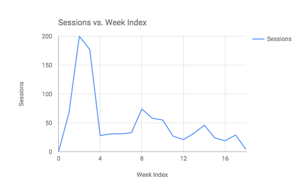
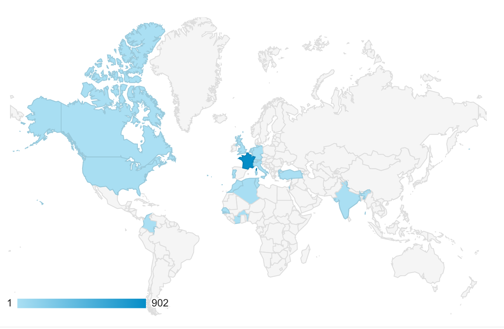
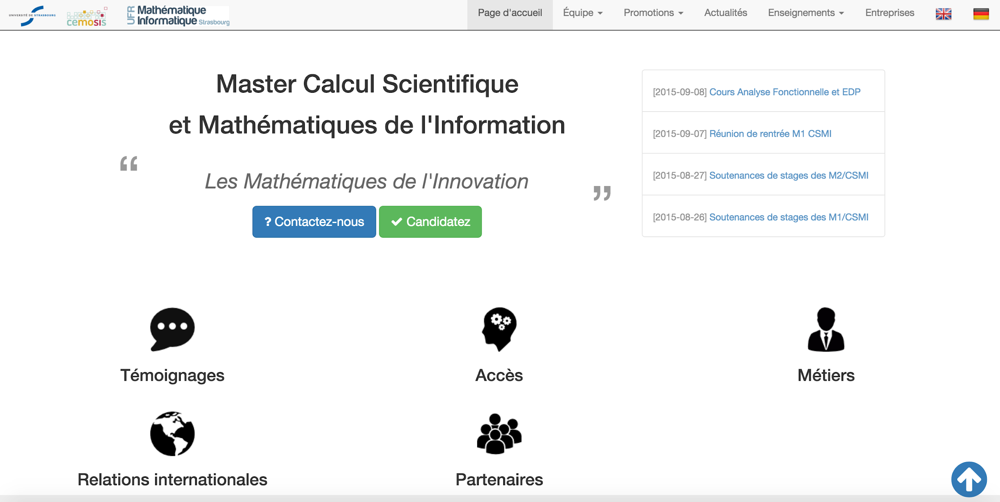
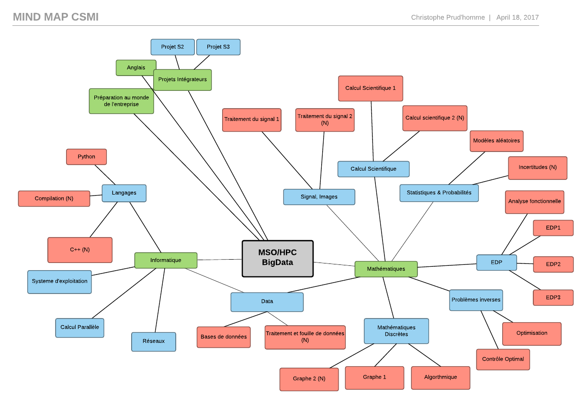
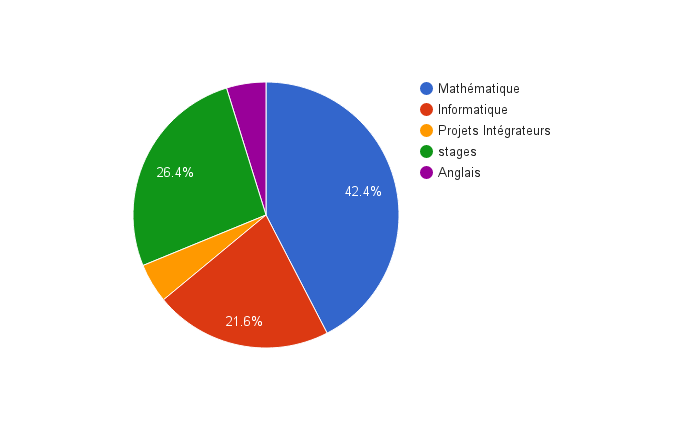
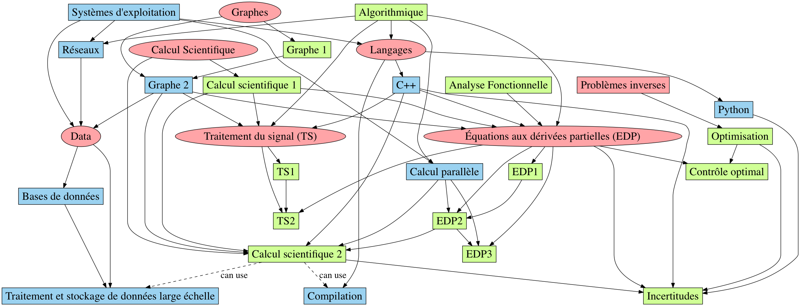

= Master CSMI
Christophe Prud'homme (resp. CSMI) - 2015-11-03
:toc: macro

// image4.png missing; replaced with image1 placeholder

== 1 Description 

=== 1.1 Introduction

Les modèles, les données et les algorithmes sont au cœur de la révolution numérique actuelle. Pourquoi ? Parce qu’ils ont la capacité de transformer l’expérience des utilisateurs et des clients tout en optimisant la productivité des entreprises. Ils sont à présent au cœur des disciplines de la recherche aussi bien dans les lettres, les sciences économiques et sociales que les sciences fondamentales, de la vie et environnementales. Être acteur de la révolution numérique requiert des compétences croisées en mathématiques et en informatique mais aussi une bonne maîtrise des différents domaines d'applications : santé, environnement, économie, micro-technologie, etc.

Google, AirBnB, Uber, Amazon, Netflix, Criteo, Climate Corporation et tant d’autres appuient leur formidable croissance sur la puissance de leurs algorithmes et sur la maîtrise des Big Data. Les laboratoires de recherche, les départements R&D, et de nombreuses start-up, utilisent la modélisation, la simulation numérique et le calcul à haute performance pour relever les défis technologiques du futur.

Derrière les réussites les plus radicales du numérique se cachent des algorithmes mathématiques puissants, capables de révolutionner l’expérience client et d’optimiser la productivité de l’entreprise.

A l’inverse, la majorité des PME françaises n’a pas pris conscience de cette évolution [Source: http://pme-bigdata.org[[.underline]#Livre blanc : "Modèles Data et Algorithmes: les nouvelles frontières du numérique"#], Aremus et associés, BPIFrance, AMIES et Genci, Nov 2015], leur éveil aux technologies de l’information est nécessaire et, espérons-le, imminent.

Pour accompagner la révolution numérique, l'État a mis en place des structures (Clusters de compétitivité), des labels (French Tech) et des lois (Lois sur le numérique, Macron 2). Mais l’offre de formation reste largement insuffisante, alors que les besoins de compétences explosent [Source: http://www.bls.gov/ooh/math/mathematicians.htm[[.underline]#http://www.bls.gov/ooh/math/mathematicians.htm#] 23% de croissance aux États Unis entre 2012 et 2022, croissance beaucoup plus rapide que la moyenne générale] .

==== 1.1.1 Le rapport EISEM

AMIES en partenariat avec les Labex de mathématiques dont IRMIA, les fondations parisiennes a commandé un rapport au cabinet de consulting CMI intitulé Etude sur l'Impact Socio-Économique des Mathématiques. Ce rapport met en avant 5 champs de compétences stratégiques embarquant à la fois des mathématiques appliquées et fondamentales (liste sans valeur hiérarchique).

* {blank}
+
____
Traitement du signal et analyse d’images ;
____
* {blank}
+
____
Data Mining (statistiques, analyse de données et apprentissage) ;
____
* {blank}
+
____
MSO (Modélisation - Simulation - Optimisation) ;
____
* {blank}
+
____
HPC (« High Performance Computing » ou calcul haute performance) ;
____
* {blank}
+
____
Sécurité des systèmes d’information et Cryptographie.
____

La maîtrise de ces champs de compétences, par les entreprises, est vue comme essentielle pour leur permettre de relever les défis industriels actuels et futurs, spécifiques ou non à leur secteur d’activité, et rester compétitives.

{empty}[Source: http://www.agence-maths-entreprises.fr/a/?q=fr/eisem[[.underline]#http://www.agence-maths-entreprises.fr/a/?q=fr/eisem#] ]

==== 1.1.2 Données, Traitement de données & Big Data

La croissance des volumes d’informations numériques est telle que les bases de données traditionnelles qui les gèrent ne suffisent plus. Il faut imaginer de nouvelles architectures (logicielles et matérielles) de nouvelles technologies hardware s'appuyant sur des algorithmes et représentations/structures mathématiques adaptés, pour générer, stocker, traiter et transporter ces masses considérables de données.

Pour donner une idée de ces volumes, il suffit de savoir que chaque jour, l'humanité produit environ 9000 nouveaux articles sur Wikipédia, environ 400 millions de tweets, 540 millions de SMS et 145 milliards de mails sont envoyés au niveau mondial ; 104 000 heures de vidéos sont mises en ligne sur YouTube, 4,5 milliards de recherches sont lancées sur Google, 552 millions d'utilisateurs sont connectés à Facebook [Source: http://www.cnrs.fr/fr/pdf/jdc/JDC269.pdf[[.underline]#le journal du CNRS&#44; N° 269#], Novembre-Décembre 2012]. Cette masse de données numériques ne cesse d’augmenter.

==== 1.1.3 Modélisation Simulation Optimisation & Calcul Haute Performance

Modélisation, Simulation et Optimisation (MSO) a été appelée le troisième pilier pour le progrès scientifique et l'innovation, aux côtés de l'expérience et de la théorie. Alors que les entreprises technologiques se développent avec des cycles de complexité croissante et des cycles d'innovation plus courts, le développement efficace et rapide de technologies industrielles dépend à présent de méthodes précises pour MSO. Cela est d'autant plus prononcé dans le contexte de l'importance croissante du calcul haute performance (HPC) et des technologies et entreprises associées aux Big Data. Le développement industriel compétitif a de plus en plus besoin d'un “produit virtuel”, qui accompagne le produit réel et permet, pour un coût beaucoup moins cher et plus rapide, la vérification du produit, l'analyse des risques et une optimisation plus efficace.

{empty}[Source: rapport de la DG Connect de la commission Européenne, participation de C. Prud'homme et AMIES]

==== 1.1.4 Et le Master CSMI ?

Le master CSMI a l'unique opportunité d'évoluer à la confluence de ces différents champs. À l'évidence nous ne pouvons couvrir cet ensemble de manière exhaustive. Nous pouvons cependant extraire un sous-ensemble cohérent et inter-connecté de cours permettant de former des étudiants de Master experts dans les domaines du traitement d'image, de la modélisation, la simulation et l'optimisation ainsi que du calcul haute performance. Ces étudiants auront la capacité et les clés de s'adapter aux exigences et évolutions rapides de la révolution du numérique ce qui nécessite d'augmenter quelque peu l'offre de cours en informatique dans le master.

=== 1.2 Historique du Master CSMI

Le master CSMI (resp P. Helluy puis C. Prud'homme) est issu de l'évolution du Master CSSI (Calcul Scientifique et Sécurité Informatique, resp. P. Helluy/M. Mignotte) qui lui-même était issu des masters de mathématique discrète (MD, resp. M. Mignotte) et calcul scientifique et visualisation (CSV, resp. E. Sonnendrucker). En 2008, les masters MD et CSV avaient des effectifs insuffisants, bien que le placement des étudiants soit excellent. Il a donc été décidé de fusionner ces deux masters dans le master CSSI offrant une double compétence en calcul scientifique et mathématiques discrètes. La maquette CSSI a été en vigueur entre 2009 et 2012. En 2013, elle a été simplifiée (moins d’options) ce qui a donné naissance au master CSMI.

=== 1.3 Principes du Master CSMI

==== 1.3.1 Lien avec la licence 

L'étudiant du Master CSMI sera bien préparé au Master en suivant le parcours de L3 de Mathématiques Appliquées. La maquette de Licence actuelle a été pensée pour amener les étudiants en Master avec les bagages mathématiques et informatiques requis.

==== 1.3.2 Évolution et contexte local

L'introduction précédente nous donne le contexte général extrêmement favorable pour une formation comme CSMI.

Par ailleurs, le contexte local pour CSMI est le suivant

* {blank}
+
____
L'évolution de l'équipe pédagogique permet une nouvelle offre de cours;
____
* {blank}
+
____
Mathématiques et Informatique sont réunies au sein de la même UFR et CSMI avait une large part d'informatique. Ces liens ont été amplifiés coté recherche, via le Labex IRMIA entre IRMA/MOCOfootnote:[L'IRMA est l'Institut de Recherche Mathématique Avancée, le laboratoire de recherche en mathématique associé à l'UFR Math-Info. MOCO est l'équipe de l'IRMA en charge du master CSMI. MOCO signifie Modélisation et Contrôle.] - ICUBE/ICPSfootnote:[ICUBE est le laboratoire des sciences de l'ingénieur, de l'informatique et de l'imagerie dont un certain nombre de membres enseignent dans le master CSMI les cours d'informatique dont l'équipe ICPS - Image Calcul Parallèle et Scientifique.]. Il s'agit de s'appuyer sur cet axe fort de recherche/collaboration pour donner un nouvel élan à la formation;
____

* {blank}
+
____
En mathématiques, nous pouvons profiter des compétences locales en EDP, Calcul&HPC, Statistique/Probabilités, Graphes, et Images;
____
* {blank}
+
____
En Informatique, nous pouvons profiter des compétences locales en Langages de programmation, Bases de données, HPC ou encore pour le traitement et le stockage de données large-échelle.
____

Ces différents points sur le contexte local nous permettent de formuler une nouvelle maquette attractive en phase avec le contexte général (national et international).

=== 1.4 Renforcement de l'attractivité

Outre le changement de maquette qui permettra certainement d'augmenter l'attractivité de CSMI, il a été entrepris plusieurs actions depuis quelques mois afin d'augmenter la visibilité et l'attractivité du Master.

En particulier

* {blank}
+
____
La création d'un site web http://csmi.eu[[.underline]#http://csmi.eu#] , http://www.cemosis.fr[[.underline]#http://www.cemosis.fr#]. Depuis sa création en juillet 2015, on arrive à plus de 7000 vues de pages du site. Avec entre 20 et 50 sessions par semaine environ. Ceci sans faire de publicité particulière hormis vers les Licences de mathématiques de l'Université de Strasbourg. Les connexions viennent essentiellement de France, mais également de l'étranger. Le site comprend des témoignages d'étudiants et d'entreprises, la description de la formation ainsi que des informations sur les débouchés de la formation. Il se décline sur l'ensemble des supports: téléphones, tablettes et ordinateurs. La Figure 1 ci-dessous présente la page principale du site.
____

Figure 1 : page principale du site web de CSMI - http://csmi.eu[[.underline]#http://csmi.eu#]

* {blank}
+
____
La création d'une plaquette attractive pour CSMI
____
* {blank}
+
____
Le lien entre la formation CSMI et Cemosis est naturel en particulier pour établir les relations avec les entreprises, fournir des stages ainsi que des projets en lien avec les entreprises. Ce lien devrait être formalisé d'une façon ou d'une autre à l'avenir.
____

=== 1.5 Mutualisation

Les cours déjà mutualisés avec le M1MF (Mathématiques Fondamentales) et M1MAG (Magistère) en particulier au S1 et S2 sont :

* {blank}
+
____
Calcul Scientifique (3 ECTS)
____
* {blank}
+
____
Optimisation (6 ECTS)
____

Certains cours non mutualisés pourraient le devenir si certains aspects intéressent le master de statistique, la formation d'actuaires, les Mathématiques Fondamentales (MF) ou le Magistère (Mag).

=== 1.6 Projets Intégrateurs

2 unités d'enseignement (UE) sont dédiées à des projets en S2 et S3. Ces UE sont définies en collaboration avec des entreprises généralement en lien avec http://www.cemosis.fr[[.underline]#Cemosis#].

En S2 et S3, une soutenance orale en anglais (éventuellement en collaboration avec le CRL), ainsi qu'en français sont prévues respectivement en mai et en décembre pour les projets. Il est proposé également que le rapport de projet soit fait en anglais.

Enfin, depuis 2013, une collaboration avec l'Université Pierre et Marie Curie et le master de calcul scientifique du Laboratoire Jacques Louis Lions a été mise en place pour les projets du S3. Un groupe d'étudiants de Strasbourg et un de Paris travaillent ensemble à distance sur un même projet d'entreprise. Des réunions régulières grâce à la salle de visioconférence de l'IRMA sont faites et des outils collaboratifs modernes sont mis en place pour le développement et suivi de projet. Cela permet entre autres aux étudiants d'apprécier la collaboration à distance et de faire des efforts de communication et présentation afin que les projets avancent.

=== 1.7 Stages

Les stages sont présents en S2 et S4 pour le master CSMI. Il s'agit pour l'étudiant d'effectuer un stage en entreprise, ou dans un centre de recherche ou éventuellement dans un laboratoire de recherche. Les étudiants sont encouragés à suivre les stages en entreprises.

En vue de la préparation à la recherche de stage, CSMI s'appuie sur l'Espace Avenir pour proposer 2 séances 1h30 chacune en S1 pour :

* {blank}
+
____
la préparation du CV et lettre de motivation,
____
* {blank}
+
____
la présentation orale et l'entretien.
____

Afin d'être le plus profitables, ces 2 séances sont à effectuer avant "Prêt pour l'Emploi"footnote:[http://www.unistra.fr/index.php?id=19773&no_cache=1&tx_ttnews%5Btt_news%5D=11095&cHash=5639c95abf067c5f0b0ba04c74954632[[.underline]#Lien Prêt pour l'Emploi#]]. À noter que l'équipe de l’Espace Avenir est disponible toute l'année pour aider les étudiants.

=== 1.8 Forum Emploi

AMIES, l'agence des mathématiques en interaction avec les entreprises et la société, dont Cemosis est une branche régionale propose un forum emploi math à Paris auquel nous tâchons d'envoyer nos étudiants selon les moyens.

Par ailleurs, il nous apparaît important de soutenir une initiative locale d'organisation d'un forum emploi certes plus modeste mais qui serait organisé par les étudiants. Les étudiants d'informatique de l’UFR en organisent déjà un. Nous proposons de rejoindre cette initiative ou d'en créer un si cela est plus opportun. AMIES pourrait soutenir cet évènement.

=== 1.9 Innovations pédagogiques

Le Master CSMI met en place quelques innovations pédagogiques qui ont été présentées pour la plupart précédemment et que nous regroupons dans cette section. Tout d'abord, le fait que le Master CSMI soit couplé fortement à l'équipe MOCO et à Cemosis joue un rôle prépondérant dans la formation des étudiants au monde de l'entreprise ainsi vers celui de la recherche.

* {blank}
+
____
2 UE projets en collaboration avec Cemosis et les entreprises en S2 et S3 en préparation des stages ainsi que la collaboration à distance sur certains projets avec l'UPMC et son master de mathématiques appliquées;
____
* {blank}
+
____
Organisation par les étudiants d'un Forum Emploi;
____
* {blank}
+
____
Nœud ECMIfootnote:[ECMI est le Consortium Européen de Mathématiques pour l'Industrie. Il regroupe à la fois des universités dans toute l'Europe mais également des entreprises. L'Université de Strasbourg participe au comité éducatif d'ECMI ainsi qu'aux initiatives telles que les semaines de modélisation en partenariat avec AMIES - L'Agence française des Mathématiques en Interaction avec les Entreprises et la Société.] et possibilité d'échanges avec de nombreuses universités en Europe et participation d'étudiants de CSMI aux semaines de modélisation (modeling week) organisées par ECMI;
____
* {blank}
+
____
Utilisation des dernières technologies en matière de développement logiciel et de collaboration tels que GitLab (plateforme proposée par l'IRMA) et GitHuB et accès aux ressources de calcul parallèle de l'IRMA ainsi que du mésocentre de Strasbourg;
____

== 

==  +

== 2 Overview de la formation

La figure ci-dessous présente une vision globale des cours CSMI.

https://www.lucidchart.com/documents/edit/ef30fc80-982a-4dad-81d2-6f6d7c17864c/0?callback=close&name=docs&callback_type=back&v=15294&s=612[]

=== 

Certains cours sont simplement renommés par rapport à la maquette CSMI précédente, ainsi le cours «systèmes hyperboliques» devient EDP3. Par ailleurs nous avons regroupé certains cours par thématiques afin de montrer la cohérence de la formation et le poids sur ces thématiques. Par exemple EDP 1 2 et 3, Traitement du signal 1 et 2, Graphes 1 et 2, Calcul scientifique 1, 2 et 3. Cela peut indiquer aussi une montée en complexité dans le contenu du cours.

L'évolution de l'équipe pédagogique et de la maquette propose un nouveau cours d’informatique(système d’exploitation) et mathématique (traitement de données). les systèmes d'exploitation constituent le chaînon manquant dans la proposition actuelle de maquette du master CSMI.

* {blank}
+
____
Comment savoir comment sont stockées les bases de données sans connaître l'organisation d'un système de fichiers ? Comment appréhender le stockage de données à large échelle sans connaître les limites de l'utilisation de la mémoire virtuelle et avoir quelques notions de systèmes de fichiers distribués ?
____
* {blank}
+
____
Les systèmes de calcul parallèle en environnement à mémoire partagée comme OpenMP reposent sur des mécanismes comme les threads et le partage de mémoire virtuelle;
____
* {blank}
+
____
La programmation système (nécessitant la connaissance de C/C++) constitue un prérequis pour l'UE de Réseaux. Ce prérequis a fait défaut depuis la disparition en 2012 de l'UE de Système du Master CSSI.
____

Les systèmes d'exploitation constituent le lien manquant entre la vision « de près », très proche du matériel, correspondant à l'utilisation optimale des ressources (UE « calcul parallèle », « calcul scientifique », « langages », « compilation ») et la vision « avec recul » nécessaire pour la mise en œuvre de systèmes complexes tels que vus dans les UE «python», «réseaux», «traitement et stockage de données large échelle». Pour faire simple, les systèmes d'exploitation constituent un des liens entre le calcul à haute performance et les Big Data.

L'UE abordera l'organisation classique des systèmes d'exploitation, la décomposition en grands concepts (système de fichiers, processus et threads, mécanismes de communication, mémoire virtuelle, virtualisation) et la mise en œuvre par la programmation système. Loin de former des spécialistes des systèmes d'exploitation, l'idée est de donner la culture générale nécessaire pour faire le lien entre les notions abordées dans les UE citées ci-dessus, mais également pour maîtriser les notions abordées par les interlocuteurs informaticiens des futurs diplômés. L'accent sera mis sur des points intéressant le calcul à haute performance ou les grands volumes de données, comme par exemple l'impact de l'organisation des données sur les performances (mémoire virtuelle), ou les mécanismes de synchronisation (verrous, sémaphores) permettant le découplage des traitements sur plusieurs processeurs.

Si le S1 apporte des nouvelles compétences en informatique, le S2 change de rythme : peu de compétences nouvelles en informatique sont apportées (seule l'UE Python), la plupart des UE utilisent et mettent en oeuvre les acquis du S1. Pour pallier ce déséquilibre, il est proposé de mettre l'UE de systèmes d'exploitation au S2, de façon à utiliser les acquis au S1 de :

- Langages Objet (C++),

- Calcul parallèle,

- Graphes.

et avant le S3 et plus particulièrement :

- Compilation,

- Traitement et stockage de données large échelle,

- Réseaux.

À noter enfin que l'informatique étant de plus en plus l'enjeu de problèmes de sécurité,

ces notions seront abordées dans les UE :

* {blank}
+
____
Langages - C++, Python, Compilation (programmation défensive, débordement de tampon),
____
* {blank}
+
____
Systèmes d'exploitation (identité, privilèges),
____
* {blank}
+
____
Réseaux (sécurisation des protocoles).
____

=== 2.1 Métiers et Compétences

Principaux métiers, ou activités/fonctions professionnelles visés

* {blank}
+
____
Ingénieur de recherche et développement
____
* {blank}
+
____
Ingénieur calcul
____
* {blank}
+
____
Data scientist
____
* {blank}
+
____
Consultant
____
* {blank}
+
____
Chargé d'affaire
____
* {blank}
+
____
Métiers de la recherche
____
** {blank}
+
____
Chercheur
____
** {blank}
+
____
Enseignant-Chercheur.
____

Principales compétences acquises à l'issue de la formation

* {blank}
+
____
Être capable d'utiliser et de mettre en oeuvre des outils mathématiques et informatiques dans les domaines suivants
____
** {blank}
+
____
Modélisation Simulation Optimisation
____
** {blank}
+
____
Signal et Image
____
** {blank}
+
____
Traitement et fouille de données
____
** {blank}
+
____
Calcul à haute performance
____
* {blank}
+
____
Savoir gérer des projets, rédiger des rapports et travailler en collaboration.
____

=== 2.2 Calendrier de mise en place

Afin de tenir compte de l'évolution de l'équipe pédagogique, cette nouvelle maquette du master CSMI sera mise en place à la rentrée 2018-2019.

=== 2.3 Nombre d'heures et organisation des cours

Concernant le nombre d'heures de cours en CSMI, 3 ECTSfootnote:[https://fr.wikipedia.org/wiki/Système_européen_de_transfert_et_d%27accumulation_de_crédits] correspondent généralement à 26 heures de cours intégré (cours et TD/TP). 6 ECTS correspondent à 52 heures.

Les cours peuvent avoir lieu en salle de cours classiques à l'UFR ou bien en salle avec des PC ou des terminaux.

L'agenda typique en CSMI est disponible en ligne https://docs.google.com/spreadsheets/d/1U3ao7s_dG7JAO_hRPJzTW_uk-cl8QM-n_Bu0iNUmLmA/edit?usp=sharing[[.underline]#ici#].

=== 2.4 Répartition des étudiants

La capacité maximum du master CSMI est de 20 étudiants par année. Nous attendons en général une quinzaine d'étudiants. La table ci-dessous donne la répartition des étudiants

[width="100%",cols="25%,25%,25%,25%",options="header",]
|===
|*Semestre* |*UNISTRA* |*Extérieurs* |*Maximum*
|S1 |5-15 |0-10 |25
|S3 |Étudiants en provenance du M1 |0 |25
|===

=== 2.5 Master S1

[width="100%",cols="26%,35%,16%,10%,13%",options="header",]
|===
|*Cours* |*Description* |*Enseignant* |*ECTS* |*Notes*
|Algorithmique a|
Complexité algorithmique; Tri; Table de Hashage; Structure de données d'arbre:

recherche de type dictionnaire (eg. red/black tree), recherche/localisation dans R^d (eg région-tree ou kd-tree); recherche dans chaîne de caractères;

|Rutger Noot |3 |Lien avec LO
|Bases de données |Introduction à la théorie et aux systèmes de bases de données. |Catherine Guth |3 |Passage de S3 à S1; base pour
|An. fonctionnelle a|
[.mark]#Eléments d'analyse fonctionnelle utiles pour le calcul scientifique et les mathématiques pour l'ingénieur:#

[.mark]#rappels de théorie de la mesure et d'analyse convexe, espaces de Hilbert de dimension infinie;#

[.mark]#convergences faibles;#

[.mark]#distributions.#

|[.mark]#Rao# |3 |Fondements théoriques pour les EDP
|C++ a|
Introduction pratique à la programmation en C++ (C++14).

Classes, héritage, patrons; STL; programmation générique, fonctionnelle, objet et meta-programmation

Applications au calcul scientifique.

a|
Vincent

Chabannes

|3 a|
Lien avec Algorithmique; utilisation de la STL pour illustrer algorithmique

Passage S2->S1

|Calcul parallèle |[.mark]#Architecture d'ordinateurs parallèle. Algorithmes parallèles: décomposition de domaine, réductions parallèles, tris. Exemple d'applications en calcul scientifique.# |Boileau/Chabannes/ Drui |3 |
|Graphe |[.mark]#Graphes : définitions, généralités. Graphes connexes. Arbres et forêts. Graphes eulériens. Graphes hamiltoniens. Graphes planaires. Nombre chromatique. Théorème des 5 couleurs. Index chromatique. Matrices d’adjacence.# |Bugeaud |3 |
|Langues |Cours d'Anglais ; soutenance en anglais de l'UE Projet; |CRL |3 |
|Calcul scientifique 1 a|
meth. num eq. diff

meth num diff finies pour edp

mise en oeuvre python

|Helluy |3 |mutualisé M1Mf
|Calcul scientifique 2 a|
résolution de syst linéaire creux

résolution de syst valeurs propres creux

meth num element fini pour edp en 1D

python avancé (interfacage)

|Navoret |3 |
|Modèles aléatoires |Loi des grands nombres, théorème central limite, méthode de Monte Carlo, méthode de rejet. Invariance d’échelle, isotropie et homogénéité stochastique. Marche aléatoire, mouvement Brownien, diffusion et calcul différentiel stochastique. Chaine de Markov, MCMC, système particulaire et recuit simulé. |Vigon |3 |
| | | |30 |
|===

=== 2.6 Master S2

[width="100%",cols="26%,29%,23%,9%,13%",options="header",]
|===
|*Cours* |*Description* |*Enseignant* |*ECTS* |*Notes*
|Traitement du signal 1 a|
Signal 1D (son) et 2D (image). Échantillonnage, Série de Fourier, filtrage par FFT, analyse temps-fréquence et phénomènes d’aliasing. Espaces chromatique et quantification. Détection de contours, ..

débruitage, segmentation, compression JPEG, calage d’image

|Vigon |3 |
|Projet |Introduction à la gestion de projets et aux outils ; projets provenant de Cemosis éventuellement en préparation à un stage en entreprise; soutenance en anglais; |Prud'homme |3 |LO de S2 à S1;
|Méth. num. EDP a|
[.mark]#Approximation par éléments finis des EDP elliptiques linéaires: espaces de Sobolev, théorèmes de compacité, théorèmes de trace, théorème de Lax Milgram. Formulation variationnelle, Approximations de#

[.mark]#Galerkin.#

Mise en oeuvre de la méthode des éléments finis;

EDP paraboliques;

Méthodes de stabilisation

Extensions aux problèmes mixtes;

Applications

a|
Rao

Prud'homme

|6 |
|Optimisation |Analyse convexe. Théorèmes d'existence et d'unicité de solution. Conditions d'optimalité : équations et inéquations d'Euler, multiplicateurs de Lagrange, relations de Kuhn-Tucker, point-selle et théorie de la dualité. Algorithmes numériques : méthodes de gradient, de relaxation, de Newton et quasi-Newton, de pénalisation et d’Uzawa. |Y Privat |6 |mutualisé
|Graphes 2 a|
Aspects informatiques des Graphes Applications: Fouille de données;

Réseau;

Grande dimension;

Google PageRank et autres algorithmes célèbres utilisant une représentation de type graphe

|Helluy |3 |
|Système d'exploitation |Composants d'un système d'exploitation: Système de fichiers Processus, threads, concurrence et synchronisation; Gestion de la mémoire, mémoire virtuelle. Virtualisation |David |3 |
|Stages |2 mois de stage en entreprises, centre de recherche ou laboratoire |Prud'homme |6 |Éventuellement en lien avec projet S2
| | | |30 |
|===

=== 2.7 Master S3

[width="100%",cols="33%,29%,18%,9%,11%",options="header",]
|===
|*Cours* |*Description* |*Enseignant* |*ECTS* |*Notes*
|Traitement du signal 2 |classification, segmentation, génération d’image, de son et de texte avec l’apprentissage profond. |Vigon |3 |
|Contrôle optimal a|
[.mark]#Notion d'état adjoint. Application à quelques EDP de la physique: Poisson, chaleur, ondes.#

[.mark]#Mise en oeuvre dans un logiciel d'éléments finis.#

|Y Privat |6 |
|Calcul scientifique 3 a|
Outils de CAO, Génération de maillage, Lien avec la simulation

Résolution de grands systèmes linéaires et non linéaires issus de la discrétisation d'EDP;

méthodes de décomposition de domaine et multigrilles; utilisation de grandes librairies de calcul comme PETSc

Introduction aux méthodes des bases réduites certifiées pour des problèmes elliptiques.

|Prud'homme |3 |
|Traitement et fouille de données a|
Statistiques descriptives.

Nettoyage des données, normalisation, traitement des valeurs extrêmes

Analyse en composantes principales.

Modèles linéaires généralisés

Pénalisation.Sur-apprentissage.

Interaction avec les bases de données

|Vigon |3 |
|Metho num EDP 2 a|
EDP hyperboliques;

Meth. volumes fini;

Meth. Galerkin discontinu;

Application: Onde, Maxwell...

|Helluy |3 |renommage
|Compilation |Programmation avancée des processeurs; Optimisation des codes; Traitement des boucles; Génération de codes; Profiling et optimisation de codes |Ketterlin |3 |
|Projet |Projet mettant en oeuvre un ensemble de connaissance proposé par une entreprise en lien avec Cemosis |Prud'homme |3 |
|Réseaux a|
Architectures réseau;

OSI;

Protocoles

|David |3 |
|Incertitudes a|
Introduction à la quantification d'incertitudes dans les simulations numériques;

Analyse de sensibilités;

Estimation de quantiles;

Estimation de probabilité de défaillance;

Réduction de modèles

|Bertrand |3 |
| | | |30 |
|===

=== 2.8 Master S4

[width="100%",cols="19%,13%,42%,26%",options="header",]
|===
|*UE* |*ECTS* |*Description* |*Proposition Enseignant*
|Langues |3 |Les cours ont lieu au S3. |CRL
|Stage |27 |De 4 à 6 mois de stage en entreprises, centre de recherche ou laboratoire. Les projets en S1 et S3 leur ont permis d'avoir été en contact avec des entreprises |Prud'homme et tutorat
|===

== Répartition des cours

Les cours de CSMI sont répartis entre mathématique, informatique, projets, stages et anglais selon les proportions du graphe ci-dessous.

Nous présentons un graphe connectant les différents cours (bleu informatique, vert mathématique, rose thématique). Ce graphe présente les connections et dépendances entre les cours.

== 3 Présentation du Master CSMI

Site web: http://csmi.eu[[.underline]#http://csmi.eu#]

Twitter: https://twitter.com/master_csmi[[.underline]#https://twitter.com/master_csmi#]

LinkedIn:

. Page CSMI https://www.linkedin.com/company/master-csmi[[.underline]#https://www.linkedin.com/company/master-csmi#]

. Forum Anciens Étudiants : https://www.linkedin.com/groups/3923807[[.underline]#https://www.linkedin.com/groups/3923807#]

Facebook:

=== 3.1 Objectifs

Le Master CSMI s'adresse aux titulaires d'une licence de mathématiques qui souhaitent s'orienter vers une carrière d'ingénieur ou vers une thèse dans un domaine des mathématiques appliquées. L'objectif de cette formation est de donner une double compétence en calcul scientifique et en mathématique de l'information.

===  +
Accès et pré-requis

Accès en première année (M1) : +
1) De plein droit pour les titulaires d'une licence de Mathématiques délivrée par l'UFR de Mathématique et d'Informatique de l'Université de Strasbourg. +
2) Sur dossier et après avis favorable de la commission pédagogique pour les titulaires d'un diplôme en Mathématiques ou Mathématiques appliquées, de niveau licence au minimum, délivré par une université étrangère et française. +
3) Sur dossier et après avis favorable de la commission pédagogique pour les titulaires d'une licence de physique ou d'informatique. +
 +
Accès en deuxième année (M2): +
Uniquement sur dossier et après avis favorable de la commission pédagogique pour les titulaires du M1 ou équivalent. +
 +
Pré-requis: Bonnes bases en analyse, en algèbre et en informatique. Goût pour la programmation, l'algorithmique et les applications des mathématiques.

===  +
Savoir-faire et compétences +

Les étudiants issus du master CSMI ont une bonne connaissance théorique et pratique de la simulation numérique et des applications informatiques de l'algèbre. Ils ont des notions de modélisation. Plusieurs projets leurs ont permis d'appliquer les connaissances acquises à des problèmes issus d'autres domaines des sciences (physique, informatique, etc.). Une bonne maîtrise de l'outil informatique leur est indispensable. La formation insiste donc particulièrement sur ce point.

===  +
Débouchés et insertion professionnelle

Les débouchés naturels sont les services de recherche et développement des grandes entreprises, les SSII spécialisées, les postes d'ingénieur dans les universités et les organismes de recherche publics ou privés.

===  +
Poursuites d'études +

Les étudiants de la filière les plus motivés par la recherche appliquée pourront également poursuivre en thèse.

===  +
Contrôle des connaissances +

Les règles générales des modalités de contrôles des connaissances sont définies au niveau de l'université et s'appliquent à tous les diplômes. +
Ces règles générales fixent les modalités de capitalisation, compensation, conservation de notes d'une année à l'autre et report de notes entre les deux sessions d'examen. +
Elles définissent les aménagements d'études accordés aux étudiants selon leurs situations particulières.
